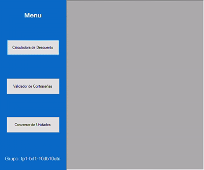
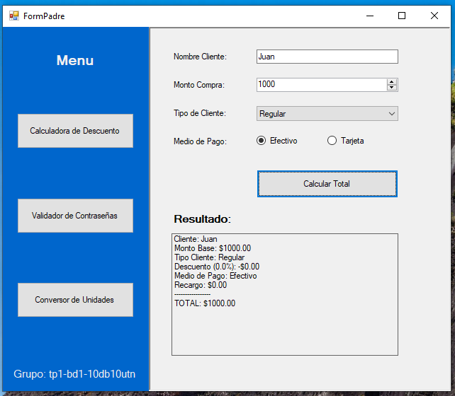
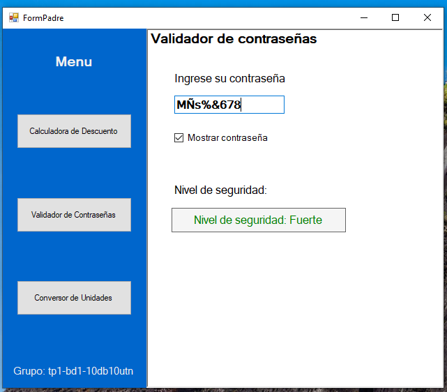
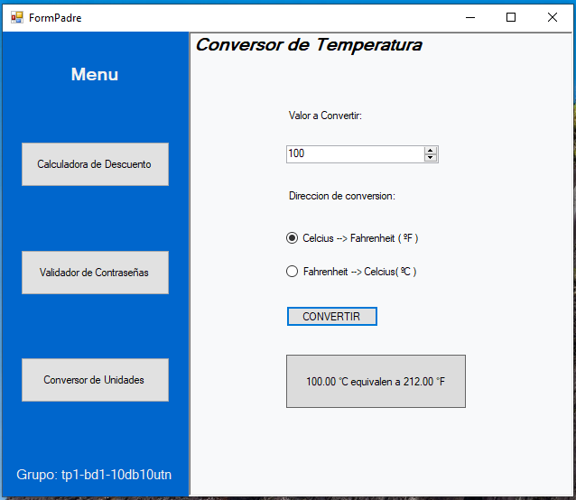
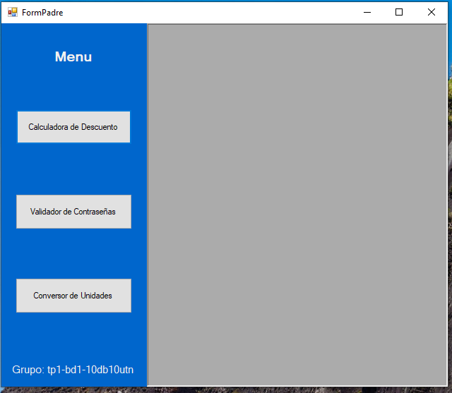

# WinForms Utilities App

Aplicación de escritorio desarrollada en **C#** con **Windows Forms** para centralizar varias utilidades prácticas en una sola interfaz. El proyecto está pensado como una demo de funciones reutilizables, validaciones y lógica separada de la vista, con una experiencia simple y clara para el usuario.

## 📹 Vista general



La app presenta un menú principal desde el cual se accede a distintas herramientas:

- Calculadora de descuentos
- Validador de contraseñas
- Conversor de temperatura

---

## 🧩 Objetivo del proyecto

Este trabajo busca demostrar cómo construir una interfaz gráfica modular y mantenible en .NET Framework, separando la lógica de negocio de los eventos de los formularios. La idea principal es reutilizar funciones, facilitar la lectura del código y ofrecer una interfaz intuitiva al usuario.

---

## ⚙️ Tecnologías utilizadas

- **Lenguaje:** C#
- **Framework:** .NET Framework 4.8
- **Interfaz gráfica:** Windows Forms
- **Patrón de diseño:** lógica separada de los eventos del formulario
- **Componentes principales:** `TextBox`, `NumericUpDown`, `ComboBox`, `RadioButton`, `Button`, `Label`, `CheckBox`

---

## 🛠️ Funcionalidades principales

### 1) Calculadora de descuentos

Permite ingresar el nombre del cliente, el monto base, el tipo de cliente y el medio de pago para calcular el total con descuento y recargo.



Características:
- Validación de campos obligatorios
- Cálculo de descuento según el tipo de cliente
- Recargo si se paga con tarjeta
- Resultado final mostrado en una etiqueta con formato legible

### 2) Validador de seguridad de contraseña

Evalúa la fortaleza de una contraseña en tiempo real y cambia el color de la alerta según el nivel de seguridad.



Características:
- Verificación de longitud
- Validación de mayúsculas y números
- Clasificación: Débil, Media o Fuerte
- Opción para mostrar u ocultar la contraseña

### 3) Conversor de temperatura

Convierte valores entre grados Celsius y Fahrenheit utilizando una lógica encapsulada con tuplas.



Características:
- Cambio de dirección de conversión
- Cálculo directo con tipos decimales
- Resultado legible para el usuario
- Ejemplo de uso de retorno múltiple mediante tuplas

---

## 🖼️ Capturas del menú principal



El formulario principal sirve como punto de acceso a todas las herramientas disponibles y se comporta como una vista centralizada con formularios hijos dentro de una aplicación MDI.

---

## 📁 Estructura del proyecto

```text
winforms-utilities-app/
├── README.md
├── LICENSE
├── assets/
│   ├── Menu.png
│   ├── Calculadora.png
│   ├── Conversor.png
│   ├── Validador.png
│   └── FormPadre.gif
└── winforms-utilities-app/
    ├── TP1-BD1-10DB10UTN.slnx
    └── Controles-Escritorio/
        ├── FormPadre.cs
        ├── FormConversor.cs
        ├── FormPassword.cs
        ├── calculadoraDescuentos.cs
        └── ...
```

---

## ▶️ Cómo ejecutar el proyecto

1. Clonar o descargar este repositorio.
2. Abrir la solución ubicada en `winforms-utilities-app/winforms-utilities-app/TP1-BD1-10DB10UTN.slnx`.
3. Verificar que tengas instalado **Visual Studio** compatible con **.NET Framework 4.8**.
4. Presionar **F5** o seleccionar **Iniciar depuración**.

> Si el proyecto no se compila de inmediato, asegúrate de tener el entorno de .NET Framework y las dependencias necesarias instaladas en tu sistema.

---

## ✅ Resultado esperado

La aplicación permite gestionar varias operaciones útiles desde una sola interfaz gráfica, mostrando una implementación clara de conceptos de programación en C#, validación de entrada y Windows Forms.

---

## 📌 Nota

Este proyecto fue desarrollado como ejercicio académico y sirve como ejemplo de aplicación desktop con formularios, validaciones y cálculo lógico en lenguaje C#.

